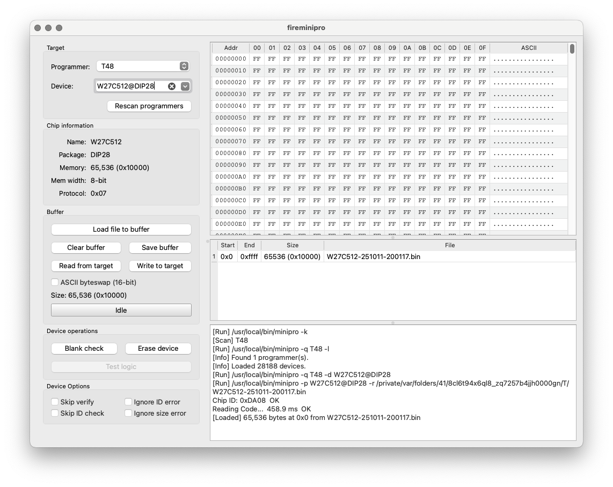
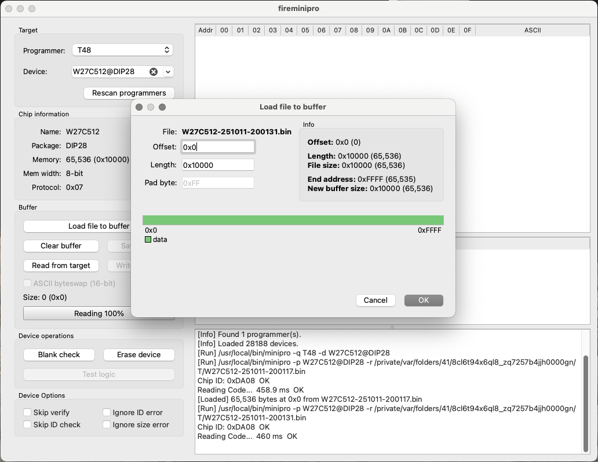

# FireMinipro

**FireMinipro** is a modern, cross-platform graphical front-end for the [Minipro](https://gitlab.com/DavidGriffith/minipro) programmer software.  
It is designed to be fast, intuitive, and lightweight — with special emphasis on **buffer management** and **visual clarity**.

Unlike traditional programmer utilities, FireMinipro lets you view, merge, and manipulate binary data buffers easily before writing to or after reading from an EPROM, EEPROM, or logic IC.  
It aims to provide a comfortable workflow for both hobbyists and professionals working with TL866, T48 and compatible programmers.

---

## Screenshots




---

## Features

- **Buffer visualization:** Load multiple binary files at arbitrary offsets, visualize overlaps, and highlight padding.
- **Flexible file operations:** Load, clear, merge, and save buffers of any size.
- **Drag and Drop:** Files loaded to buffer can be reorganized by dragging, or you can drag files to the buffer from file explorer / finder.
- **Device awareness:** Automatically detects connected Minipro programmers and supported device lists.
- **Chip info:** Displays memory size, package and protocol details directly from Minipro.
- **Device operations:** Blank check, erase, logic test, read, and write functions fully integrated.
- **Progress tracking:** Live progress and operation status while reading or writing chips.
- **Cross-platform support:** Works on both macOS and Linux using Qt6.

---

## Releases

If you do not feel comfortable building software yourself, there are
**AppImage for Linux** and **DMG for MacOs** (12 and up) provided in the [releases](https://github.com/Jartza/fireminipro/releases/) page.

---

## Building prerequisites

### macOS
Install dependencies using [Homebrew](https://brew.sh/):

```bash
brew install cmake ninja qt6 minipro
```

Either follow the build instruction below, or if you are brave, instead of above line, use the following:
```bash
brew tap Jartza/fireminipro
brew install --build-from-source fireminipro
```
After which you can start fireminipro from command-line.


### Linux (Ubuntu/Debian)
You need Minipro and the development toolchain for Qt6 and CMake.  
Install required packages using:

```bash
sudo apt update
sudo apt install build-essential ninja-build cmake libgl1-mesa-dev qt6-base-dev libxkbcommon-dev
```

> **Note:**  
> The `minipro` package is not available in most distributions by default.  
> You can install it manually by cloning and building from source:
> ```bash
> git clone https://gitlab.com/DavidGriffith/minipro.git
> cd minipro
> make
> sudo make install
> ```

---

## Building FireMinipro

### 1. Clone the repository
```bash
git clone https://github.com/Jartza/fireminipro.git
cd fireminipro
```

### 2. Configure and build
FireMinipro uses **CMake** and **Ninja** for fast, cross-platform builds.

```bash
mkdir build
cd build
cmake -G Ninja ..
ninja
cd ..
```

### 3. Run the application
On macOS:
```bash
./build/fireminipro.app/Contents/MacOS/fireminipro
```

On Linux:
```bash
./build/fireminipro
```

---

## Using FireMinipro

1. **Connect** your supported programmer (T48, TL866II+, etc.).  
2. FireMinipro automatically detects connected devices at startup.  
3. **Select** your target chip and use the built-in *Device Operations* to:
   - Read chip contents into the buffer.
   - Write buffer data to the chip.
   - Load files into buffer at freely definable offset
   - Perform read, write, erase, blank check, or logic IC test operations.
4. **Edit or combine** ROM/binary file data directly in the buffer before writing.

---

## Notes

- Current version is based on few days of work and might not yet be complete or even usable for all
  purposes. Please report issues!
- FireMinipro uses `minipro` under the hood, so your connected programmer must be supported by Minipro.
- On macOS, the app includes a custom icon and can be bundled as a `.app` package for easier launching.
- On Linux, the icon will appear in most desktop environments after installation (when packaged later).

---

## TODO

- Implement device `verify` option
- Remove TEMP files that are created during runtime
- Parsing the Logic IC test output, for now it's just printed to log

---

## License

This project is released under the MIT License.  
See [LICENSE](LICENSE) for details.

### Third-party components & Acknowledgements

FireMinipro bundles a few external utilities inside the macOS and Linux packages.  
The corresponding source archives and licence texts live in [`thirdparty/`](thirdparty/):

- **minipro** (GPLv3) by David Griffith – used to communicate with TL866/T48 programmers.  
- **libusb** (LGPL 2.1) – runtime dependency required by `minipro`.

The DMG/AppImage builds copy the relevant licences into `Resources/thirdparty/` so users
always have access to the attribution and source information.

**Qt6** is used as the cross-platform GUI framework.
